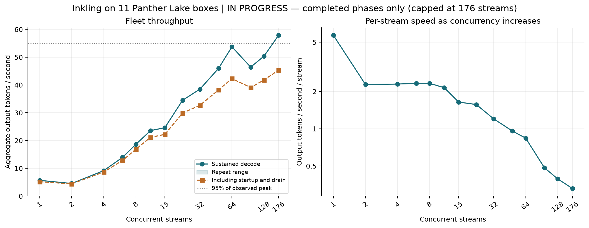
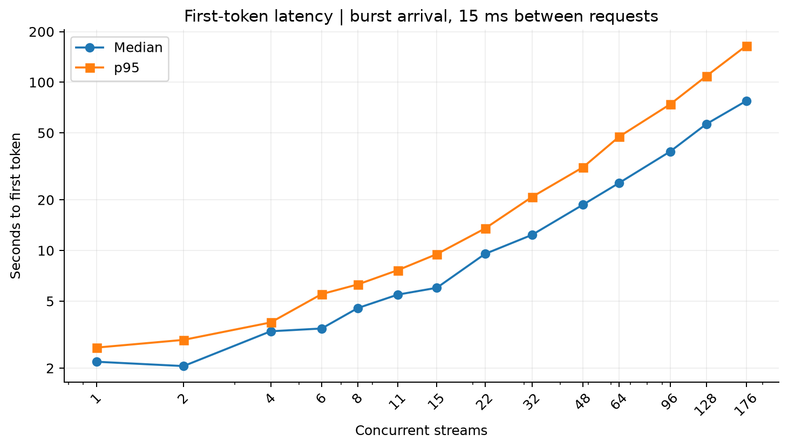

# Inkling fleet performance survey

IN PROGRESS — completed phases only (capped at 176 streams)

Eleven Panther Lake boxes; release `1790016660`; int4 experts and int8 attention. All survey requests use temperature 0 and a 128-token output budget. Counts include reasoning and answer tokens.

Sustained decode is measured only while all requests in each cohort are decoding. End-to-end throughput includes admission, prefill and drain. Prompts are repeated across sweep passes; learned phrase history remains enabled. Repeat ranges are observed variability, not confidence intervals. The fixed prompt pools are finite: high-concurrency family cohorts can repeat identical prompts. `unique_prompts` in the phase CSV records diversity; family maxima describe these pools, not a guarantee for arbitrary novel prompts.

At high concurrency, the engine’s 64-entry pending queue can reject a burst before the API’s 512-request limit is reached. Only explicit capacity rejections are retried with bounded backoff; retry counts are recorded and all queueing time remains included in TTFT and end-to-end throughput. Other errors stop the run.

The bounded diagnostic capture reached its storage budget during the first 22-stream attempt. That incomplete attempt was excluded and repeated. Capture writes were enabled for the ascending 1–15-stream points and disabled thereafter; the reverse sweep and family tests use the same capture-disabled state. No worker restarted and no model configuration changed. Repeat differences therefore include phrase learning, time/order effects and this instrumentation change.

Two initial 128-stream attempts were excluded: one received an admission 503, and the next received an engine no-progress error before generating tokens. The workers did not restart. A subsequent correctness gate passed; the verified-idle retry then completed all 128 requests without capacity retries. These interruptions are retained in [stress attempts](stress-attempts.json). Completed-run throughput is not an error-rate or reliability estimate.

The 256-stream attempt disconnected during admission. Outstanding requests were cancelled, the unchanged fleet returned to idle, and the correctness gate passed again. The remaining survey was capped at **176 streams**. The planned 256-stream repeats and conditional 352-stream extension were therefore not completed. This is an observed failure, not proof of a hard engine concurrency limit; the measured optimum is bounded by the tested range.

Best observed sustained aggregate: **57.94 tok/s at 176 streams**.
Smallest tested setting within 95% of that peak: **176 streams**.
Best observed throughput including startup/drain: **45.37 tok/s at 176 streams**.

These are different objectives from maximizing each user’s speed. Use the latency and per-stream columns to choose an operating point.

| Streams | Runs | Decode tok/s | Decode tok/s/stream | Including startup tok/s | TTFT median / p95 (s) |
|---:|---:|---:|---:|---:|---:|
| 1 | 1 | 5.68 | 5.68 | 5.19 | 2.18 / 2.65 |
| 2 | 1 | 4.55 | 2.28 | 4.40 | 2.06 / 2.94 |
| 4 | 1 | 9.18 | 2.30 | 8.69 | 3.31 / 3.74 |
| 6 | 1 | 13.94 | 2.32 | 12.83 | 3.44 / 5.51 |
| 8 | 1 | 18.62 | 2.33 | 16.86 | 4.55 / 6.28 |
| 11 | 1 | 23.58 | 2.14 | 21.15 | 5.47 / 7.64 |
| 15 | 1 | 24.63 | 1.64 | 22.23 | 6.00 / 9.52 |
| 22 | 1 | 34.50 | 1.57 | 29.89 | 9.54 / 13.51 |
| 32 | 1 | 38.48 | 1.20 | 32.68 | 12.39 / 20.81 |
| 48 | 1 | 46.01 | 0.96 | 38.24 | 18.72 / 31.24 |
| 64 | 1 | 53.74 | 0.84 | 42.30 | 25.21 / 47.49 |
| 96 | 1 | 46.43 | 0.48 | 39.09 | 38.75 / 73.97 |
| 128 | 1 | 50.36 | 0.39 | 41.79 | 56.42 / 108.73 |
| 176 | 1 | 57.94 | 0.33 | 45.37 | 77.46 / 164.87 |

| Minimum sustained tok/s/stream | Highest tested concurrency meeting it |
|---:|---:|
| 1 | 32 |
| 2 | 11 |
| 3 | 1 |
| 5 | 1 |
| 10 | None |

Data: [phase CSV](phase-results.csv), [per-request CSV](request-results.csv), [full sanitized phase measurements](measurements.json). Each chart is also available as SVG and PDF.

The exact prompts, generated text, per-event token timing and raw fleet telemetry are retained privately under the operator’s autolab-telemetry directory. No host names, addresses or raw telemetry are included here.

[Role diagnostics](role-diagnostics.csv) contain numeric compute, memory and fallback observations. Profile windows must fit entirely inside the shared decode interval and contain no admissions. These sampled counters exclude startup and drain; their correlations do not establish causes.
