# sycl-llama `--elastic` — figures

All numbers come from [`data.json`](./data.json) (verbatim copy of
`experiments/2026-10-04-elastic-campaign-v3/pr/pr-summary.json`).

| Figure | Point |
|---|---|
| 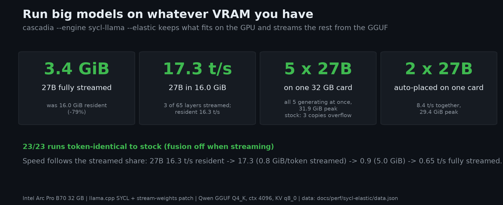 | `fig0_hero.png` — run big models on whatever VRAM you have (headline stats). |
| 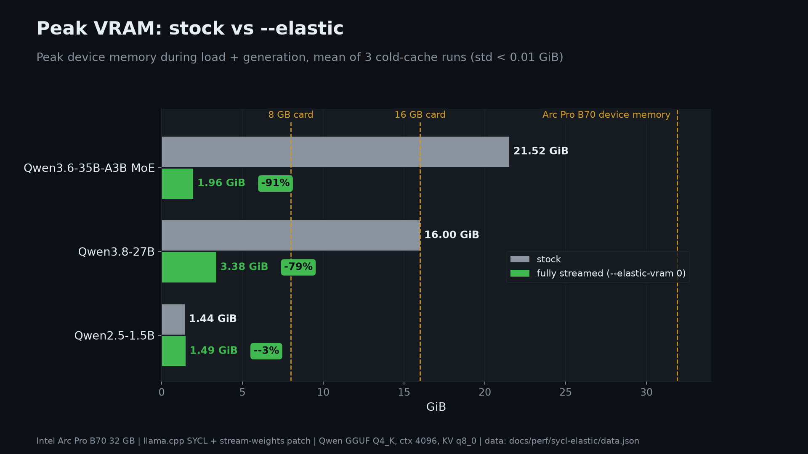 | `fig1_vram.png` — peak VRAM stock vs `--elastic`, per model. |
| 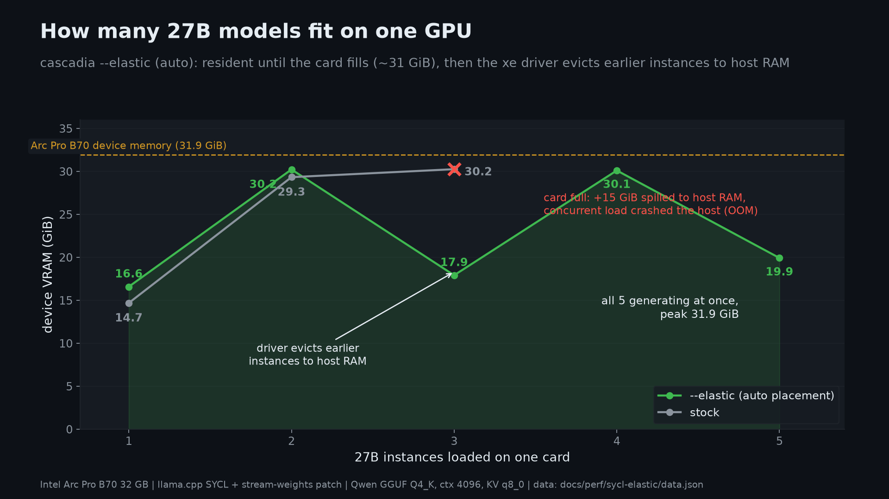 | `fig2_packing.png` — how many 27B instances fit on one card. |
| 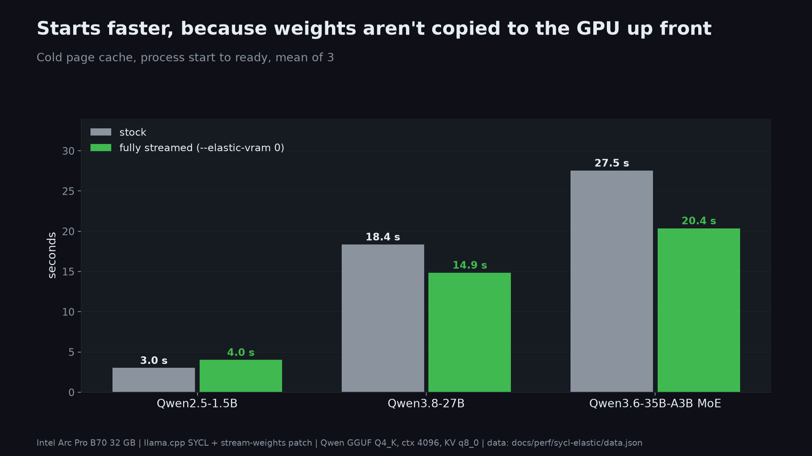 | `fig3_load.png` — cold-start time, stock vs `--elastic`. |
|  | `fig4_tradeoff.png` — the cost of streaming everything (`--elastic-vram 0`). |
| 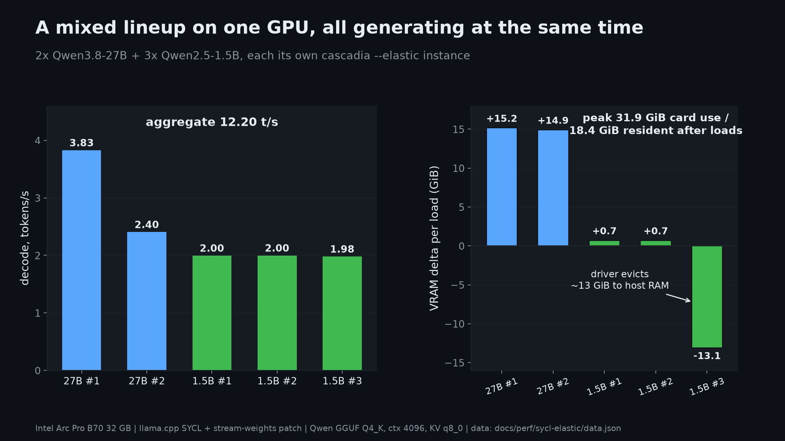 | `fig5_fleet.png` — mixed fleet (2x 27B + 3x 1.5B) on one card, all generating. |
| 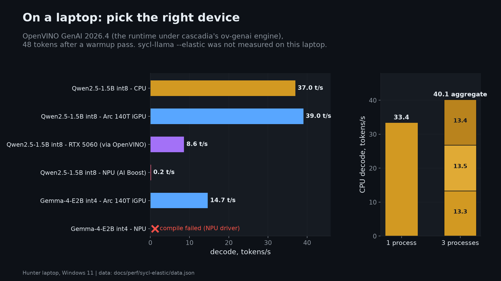 | `fig6_laptop.png` — laptop reference: which device to pick (no elastic on laptop). |
| 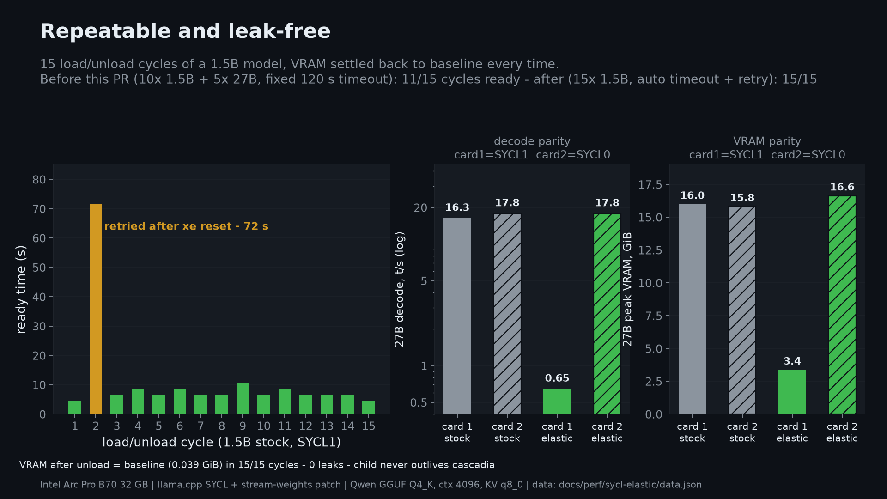 | `fig7_reliability.png` — 15 load/unload cycles, leak-free, plus second-card parity. |
| 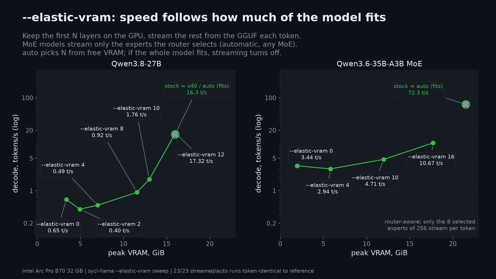 | `fig8_partial.png` — `--elastic-vram` budget sweep: speed follows how much of the model fits. |
| 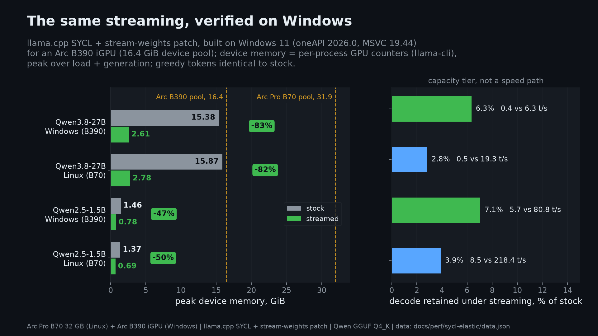 | `fig9_windows.png` — the same streaming on Windows (Arc B390 iGPU): Linux vs Windows device memory + decode retention. |
| 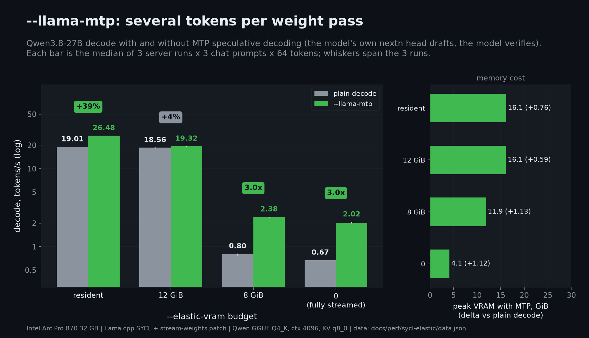 | `fig17_mtp.png` — `--llama-mtp` decode on Qwen3.8-27B per `--elastic-vram` budget (median of 3 runs, whiskers = run spread) and its VRAM cost. Data: `data.json` `mtp`; harness `experiments/2026-10-10-review3/spec/mtp_sweep.py`. |
| 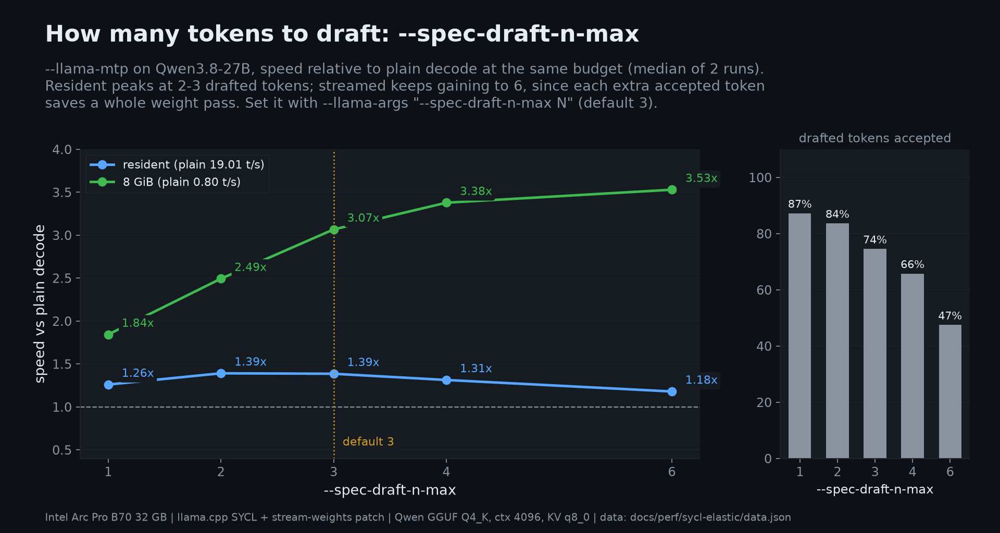 | `fig18_mtp_draft_n.png` — `--spec-draft-n-max` sweep under `--llama-mtp`: resident vs 8 GiB budget, speed relative to plain decode, and draft acceptance. Data: `data.json` `mtp_draft_n`. |
| 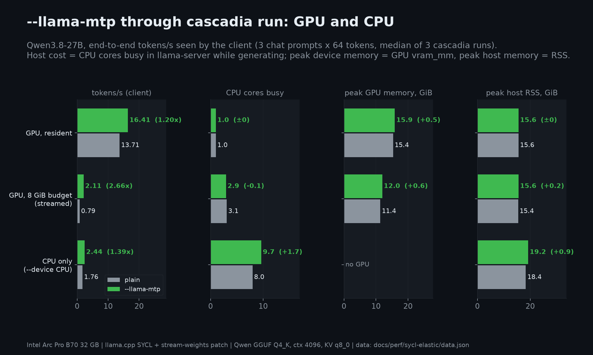 | `fig19_mtp_cpu_gpu.png` — `--llama-mtp` through `cascadia run` on GPU (resident, 8 GiB streamed) and CPU: client t/s, CPU cores, peak VRAM and host RSS, with deltas. Data: `data.json` `mtp_cpu_gpu`; harness `experiments/2026-10-10-review3/spec/mtp_cpu_gpu.py`. |

Placement study on a UMA iGPU (Arc B390, Linux), stock vs streaming vs
pinned host memory computed in place: [`placement-b390.md`](placement-b390.md).

## Methodology

- **Hardware (B70 box):** 2x Intel Arc Pro B70 32 GB, kernel 7.0.0-28 (`xe`
  driver), Mesa 26.2.2, Intel compute-runtime 14.37020, oneAPI 2026.0
  (icx/icpx SYCL build of llama.cpp + stream-weights patch,
  `patches/llama.cpp/0001-sycl-stream-weights.patch`).
- **Models:** Qwen2.5-1.5B-Instruct Q4_K_M, Qwen3.8-27B UD Q4_K_S,
  Qwen3.6-35B-A3B UD Q4_K_XL (GGUF).
- **Settings:** `--llama-ctx 4096`, KV cache `q8_0`, `-fa on`, temperature 0,
  thinking off.
- **Data generations:** `single` / `partial` / `cotenant_auto` / `fleets` /
  `lifecycle` / `latency` / `parity` were re-run 2026-10-07 on the async
  stream-pool build (per-device copy queues, pinned staging ring,
  parity slots, prefetch scan) on SYCL0. Cold model file via
  `posix_fadvise(DONTNEED)` before each arm — `drop_caches` is avoided: on
  this xe host it leaks kernel memory; n=3-6 for repeated arms, n=1-2 for
  budget arms. `--elastic` auto placement is resident-first, so fleet VRAM
  curves (fig2, fig5) now show the real contention behaviour: once the
  card fills (~31 GiB) the xe driver evicts earlier instances to host RAM
  and the evicted instances decode at host-page-fault rates. The v3 MoE
  stock number (34.2 t/s) is superseded — post-reboot it measures 78 t/s
  with both binaries (host state). Lifecycle `settle_s` is reported as
  unavailable: the desktop baseline on this host (~0.5 GiB) exceeds the
  150 MiB settle target, so it never settles.
- **Router-aware MoE (0002 patch):** the MoE rows of `partial` / `single` /
  `single_v3_campaign` and the `MoE` curve in fig8 come from the same-day
  sweep of the patched build (n=3 for stock and v0); the pre-0002
  every-expert-streamed curve is kept as `MoE_all_experts` (dashed in fig8).
  `expert_cache_arms` records the opt-in hot-expert cache experiment.
- **Runs:** means over repetitions; decode/prefill are server-side
  `timings.predicted_per_second` / `prompt_per_second` (not end-to-end).
- **VRAM:** kernel `vram_mm` under debugfs, sampled ~3 Hz during
  load + decode; peak reported.
- **Greedy parity:** compare streamed arms against an *unfused* resident
  reference (`GGML_SYCL_ENABLE_FUSION=0`; streaming turns fusion off, and
  fused kernels change numerics), and run **both** arms with
  `GGML_SYCL_ENABLE_DNN=0 GGML_SYCL_ENABLE_OPT=0`. Two upstream effects
  otherwise make the *reference* move:
  - oneDNN's fp16 prefill GEMM is not run-to-run deterministic on this
    stack; an unpatched build at the pinned base flips its own greedy
    output at near-ties (Qwen1.5-MoE, top-2 gap 0.006).
  - resident MoE experts are reordered in place on the first single-token
    MoE op, so later prefills in the same server use the reorder kernels
    while streamed expert slices stay in file layout. The resident output
    then depends on request order (a fresh server matches the streamed
    arm on whichever prompt it answers first).

  Measured 2026-10-10 (3 prompts x 64 tokens): 27B at 0/65 and 62/65
  resident matches byte for byte with oneDNN off alone; 35B-A3B at 0/40 and
  20/40 resident matches with both knobs off; Qwen1.5-MoE logprobs are
  float-equal with oneDNN off.
- **Laptop (fig6 only):** Core Ultra 9 285H (Arc 140T iGPU, RTX 5060
  Laptop, AI Boost NPU), 32 GB RAM, Windows 11, OpenVINO GenAI 2026.4 via
  `ov-genai`; 48 tokens after an 8-token warmup.
- **Windows (fig9):** Core Ultra X7 358H (Arc B390 iGPU, 16.4 GiB device
  pool), Windows 11, oneAPI 2026.0 (icx) + MSVC 19.44 build of the patched
  llama.cpp via `scripts/build-llama-stream-windows.bat`; device memory =
  per-process GPU performance counters (llama-cli), peak over load +
  generation; `-c 4096` on both arms.

## Reproduce

```bash
# 1. build the patched llama-server and point cascadia at it
scripts/build-llama-stream.sh ~/llama-stream
export CASCADIA_LLAMA_BIN=~/llama-stream/build/bin/llama-server
source /opt/intel/oneapi/setvars.sh   # child needs the oneAPI runtime libs

# 2. per arm (stock arms drop --elastic); the 2026-10-07 refresh used
#    SYCL0 (SYCL1 had a vLLM co-tenant); the original campaign used SYCL1
cascadia run /path/to/Qwen2.5-1.5B-Instruct-Q4_K_M.gguf \
  --engine sycl-llama --device SYCL1 --llama-ctx 4096 \
  --llama-args "-ctk q8_0 -fa on" --api 127.0.0.1:19600          # stock
  # + --elastic                                                  # elastic
cascadia run /path/to/Qwen3.8-27B-UD-Q4_K_S.gguf   ... same flags
cascadia run /path/to/Qwen3.6-35B-A3B-UD-Q4_K_XL.gguf ... same flags

# 3. VRAM (needs root): SYCL0 = pci 0000:0b:00.0, SYCL1 = 0000:0f:00.0 here
sudo cat /sys/kernel/debug/dri/<pci>/tile0/vram_mm   # "usage:" line

# 4. --elastic-vram sweep + co-tenancy (harnesses live in
#    experiments/2026-10-04-elastic-campaign-v3/pr/partial/, not committed)
cd experiments/2026-10-04-elastic-campaign-v3/pr/partial
python3 partial.py sweep 27B stock unfused v0 v2 v4 v8 v10 v12 auto v40
python3 partial.py sweep MoE stock v0 v4 v10 v16 auto   # 0002: router-aware experts
python3 moe_cache.py moec MoE c0 c4 k64 k512            # opt-in expert-cache arms
python3 partial.py sweep 1.5B stock unfused v0 auto
python3 cotenant.py sweep/cotenant-auto-2.json 2

# 5. fold the runs into data.json, then draw
python3 docs/perf/sycl-elastic/update_data_moe.py
experiments/2026-10-04-elastic-campaign-v3/venv/bin/python \
  docs/perf/sycl-elastic/make_figs.py
```

The measurement harnesses live in
`experiments/2026-10-04-elastic-campaign-v3/` (`v3.py` arms,
`v3_life.py` / `pr/life_retry.py` lifecycle, `v3_conc.py` fleets,
`v3_sampler.py` VRAM sampler, `pr/partial/partial.py` + `cotenant.py`
for the budget sweep).
