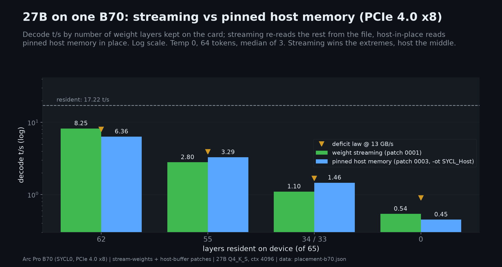
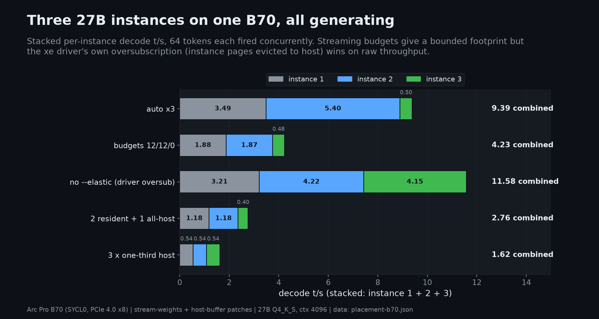
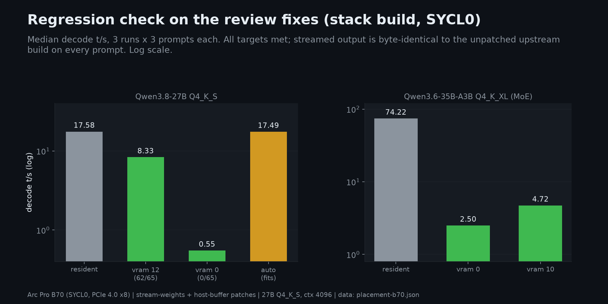
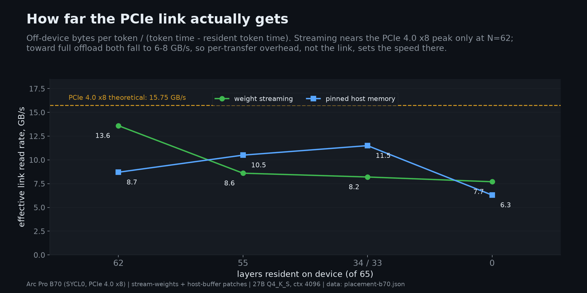
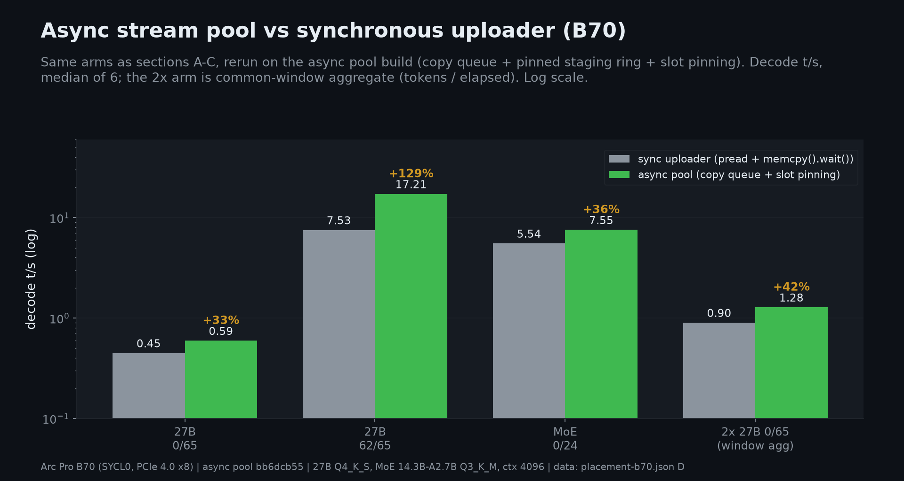
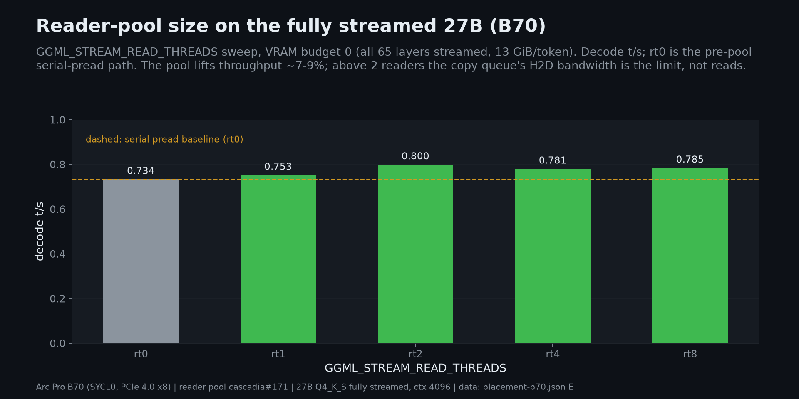
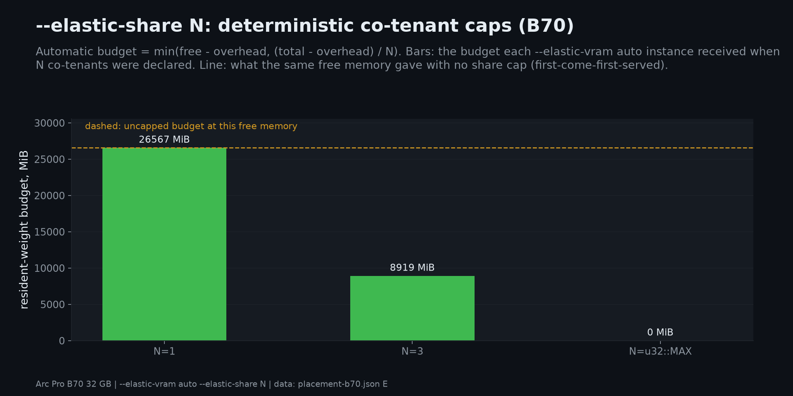

# Placement study: streaming vs pinned-host vs driver oversubscription (B70)

Measured 2026-10-06 on the B70 host (2x Intel Arc Pro B70 32 GB, xe driver,
oneAPI 2026.0) against `feat/sycl-llama-elastic-stack` (`82aa11d`) with
`llama.cpp` patches 0001+0002+0003 built at pinned base `1692f9e50`
(`scripts/build-llama-stream.sh`, markers verified). Raw data:
`experiments/2026-10-05-placement-b70/` (not committed).

Updated 2026-10-06 with section D: the dense arms re-run against the async
stream pool (`bb6dcb55` on `feat/sycl-llama-elastic`) - every streaming arm
is faster, and section D has the numbers and the common-window aggregate
method that section C's summed column lacks. Note the MoE arm differs:
sections A-C measured Qwen3.6-35B-A3B (40 layers), section D measured
Qwen1.5-MoE-14.3B-A2.7B Q3_K_M (24 layers) - the two are not comparable.

Updated 2026-10-08 with section E: file reads moved off the dispatch
thread onto a bounded reader pool (+7-9% fully streamed; the strace's
serial-`pread` bottleneck is confirmed but H2D copy bandwidth is the new
limit), and `--elastic-share N` gives co-tenants a deterministic resident
cap. Section E has the sweep, the MoE small-slice regression, and the
three-tenant run.

## Findings

Measured on one Arc Pro B70 (SYCL0) on a host whose GPU links run at **PCIe 4.0 x8 (~15.75 GB/s)**. Sections A-C report medians of 3 outer runs (9 timed requests per arm); section D reports medians of 6.

### What works (wins)
1. **The fixed patches hold up on a discrete card.**
   - 27B decode speeds: `--elastic-vram 12` 8.33 t/s (62/65 layers on device), `--elastic-vram 0` 0.55 t/s, and `auto` 17.49 t/s ("model fits, streaming disabled", same speed as resident).
   - Streamed output is byte-identical to unpatched upstream llama.cpp.
   - The streamed child holds 1 model fd and no `LD_PRELOAD`, and it dies with cascadia.
2. **Streaming saturates the link when little is streamed.** At N=62 it moves ~13.6 GB/s model-implied (see section B: incremental bandwidth, an upper bound), about 86% of the x8 Gen4 ceiling. The deficit law at 13 GB/s predicts 8.05 t/s; we measured 8.25.
3. **Streaming wins at the parking end.** At N=0 it decodes at 0.54 t/s vs 0.45 for host-in-place, and it has the smallest footprint: a 3.05 GiB peak vs 16.15 GiB resident (−81%).
4. **Pinned host memory read in place (patch 0003) wins mid-range** *(measured on the sync build; async streaming may shift the crossover)*. It is +18% at N=55 and +33% at N=34/33, with fused ops and graphs still on. The cascadia path (`--llama-host-layers`) works: 6.25 t/s, output identical to resident.
5. **Co-tenancy is stable.** In every section-C arm, three 27B instances loaded and generated together with no load failures and no xe resets. `auto` reached 9.4 t/s summed per-instance (see the sum caveat in section C).
6. **UPDATE (section D): the async stream pool lifted every streaming arm.** 0/65 +33% (0.448→0.595 t/s), 62/65 +129% (7.53→17.21, resident speed via slot pinning), MoE +36%, and two co-tenant streamed instances +42% aggregate (0.90→1.28 t/s, common-window method).
7. **UPDATE (section E): the reader pool buys a further +7-9% fully streamed** (0.734→0.800 t/s at rt2) and `--elastic-share N` makes `auto` co-tenant-safe: three 27B cascadia instances each declared N=3, all loaded and served, burst aggregate 0.99 t/s, clean teardown.

### What doesn't (deficiencies)
1. **Full streaming uses only about half the link** *(superseded by section D)*. At N=0 the sync build reached ~6.3-7.7 GB/s; the async build moved ~8.3 GB/s (+33%) and is likely read-bound on single-threaded `pread` (hypothesis, not traced). Host-in-place still ~6.3 GB/s.
2. **Host-in-place loses with only a few layers off-device.** At N=62 it is −23% vs streaming (6.36 vs 8.25), reading at only ~8.7 GB/s. It is not a drop-in replacement across the range.
3. **Driver oversubscription beats every elastic arm for 3 instances** *(sync-build sums; not re-run under async or the common-window method)*. Plain loading with no `--elastic` reached 11.6 t/s summed per-instance. That compares with 9.4 for `auto`, 4.2 for explicit budgets (12/12/0), and 2.8 / 1.6 for the two host-placement arms. The trade-off is no residency guarantee: the driver decides what gets moved to host memory.
4. **Budgets don't compose under contention.** Each of the two 62/65 instances in the 12/12/0 arm fell from 8.33 t/s alone to 1.88 t/s (−77%), because all three instances share one link.
5. **`auto` splits first-come, first-served.** Instance 2 got 63/65 layers (5.40 t/s); instance 3 got 0/65 (0.50 t/s) and warned it lacked headroom (1913 MiB free vs ~4267 MiB needed). Nothing rebalances after load.
6. **Tate's host-placement predictions (~14 t/s at N=62, ~3 t/s at N=0) can't be reached here.** They assume a ~50 GB/s Gen5 x16 link. A Gen5 x16 host is untested and could change the ranking.

### Caveats
- The study ran on SYCL0 instead of SYCL1, whose absolute t/s is ~9% lower than the 0f card; all comparisons are within one card.
- The stack's fused resident path flips one greedy near-tie (one prompt, char 109). It is not a streaming bug: with fusion off, resident output equals upstream and streamed output.
- vram_mm can't show host spill. Oversubscription is inferred from capacity: three 27B models don't fit in 31.89 GiB.

### Recommendation
- Keep streaming + `auto` as `--elastic` on discrete cards.
- Next work, in order:
  1. ~~Async prefetch, for the N=0 gap~~ - done, see section D (+33% at N=0; the residual gap is serial `pread`, not DMA).
  2. ~~Parallel/file-reader offload~~ - done, see section E (+7-9%; the H2D copy path, not reads, is the residual limit).
  3. ~~A fairer `auto` split~~ - `--elastic-share N` covers the load-time cap (section E); promote/demote after load and wider/fused H2D copies remain.
  4. Retest host placement on a Gen5 x16 host.
- Document driver oversubscription as the throughput-first alternative when residency guarantees don't matter.

## Deviation from the recipe

The recipe's card (SYCL1 / PCI 0000:0f:00.0) was occupied by an unrelated
`vllm serve` (~14.7 GiB) for the whole study, so **all measurements run on
SYCL0 = PCI 0000:0b:00.0** instead: `-dev SYCL0` / `--device SYCL0`, VRAM from
`/sys/kernel/debug/dri/0000:0b:00.0/tile0/vram_mm` ("usage:" line, ~3 Hz
sampling, peak reported). The 0f card read `usage: 14675709952` bytes before
*and* after the study - untouched. Absolute t/s on 0b run ~5-10% below the
campaign's 0f numbers (same silicon, different slot/power envelope); all
comparisons below are within-card so relative conclusions hold.

Other deviations:
- `~/llama-stack` is replaced by
  `/mnt/nvme-wd-sn770-500gb-data/placement-b70/llama-stack` (root fs was
  nearly full); the build script ran unchanged.
- The recipe's `--load-mode read` is not a valid value in this llama.cpp
  (`auto|none|mmap|mlock|mmap+mlock|dio`); the host arms used
  `--load-mode none`, which is what the patch intends (mmap off -> the
  loader reads weights into the host buffer; cascadia's
  `--llama-host-layers` emitted the equivalent `--no-mmap` for this study and
  emits `--load-mode none` since 2026-10-10).
- The stack's 0001/0002 differ from the PR-171 head's regenerated pair
  (ours adds the slot-pool teardown in 0001, the expert-arena cleanup in
  0002, and the `host_unified_memory` iGPU-classification fallback). None
  of that affects B70 measurements, so section A was still run on the
  stack build as specified.

## Section A - regression of the fixed patches (27B, `cascadia run`, SYCL0)

Median of 9 samples (3 runs x 3 prompts), decode = child llama-server
`timings.predicted_per_second`, ctx 4096, `-ctk q8_0 -fa on`, temp 0, 64
tokens.

| arm | decode t/s median (range) | expected | stream-weights line |
|---|---|---|---|
| resident (stack, no `--elastic`) | 17.58 (17.49-17.67) | ~19.3 on 0f | - |
| `--elastic-vram 12` | **8.33 (8.25-8.36)** | ~8.35 | `resident layers 62/65 (12265 MiB resident, 821 MiB streamed per token)` |
| `--elastic-vram 0` | **0.55 (0.54-0.55)** | ~0.55 | `resident layers 0/65 (0 MiB resident, 13087 MiB streamed per token)` |
| `--elastic` (auto) | 17.49 (17.33-17.62) | stock speed | `model fits (13087 MiB), streaming disabled` |
| MoE resident | 74.22 (73.85-74.55) | - | - |
| MoE `--elastic-vram 0` | **2.50 (2.48-2.51)** | ~2.61 | `resident layers 0/40` + `moe experts: router-aware expert streaming active (120 routed tensors)` |
| MoE `--elastic-vram 10` | **4.72 (4.59-4.80)** | ~4.91 | `resident layers 20/40 (10137 MiB resident, 10141 MiB streamed per token)` |

All targets hit within noise once the 0f->0b card delta is accounted for.

Process hygiene on the fully-streamed instance:
`fd | grep -c gguf` = **1**; child env has **0** `LD_PRELOAD` (parent had
`libcascadia_elastic.<pid>.so` + a user preload), only
`GGML_STREAM_WEIGHTS=1`/`GGML_STREAM_VRAM_MB=0` set; `kill -9` of cascadia
-> child gone in <1 s (measured at the 3 s check), VRAM back to idle.

Greedy parity (3 fixed prompts, 64 tokens): streamed arms (v12, v0) are
**byte-identical to the unpatched upstream build** at 1692f9e50 on all
three. The stack's own *fused* resident path flips one greedy near-tie at
char 109 of the first prompt - `GGML_SYCL_ENABLE_FUSION=0` resident output
equals upstream stock and streamed output exactly, so the streamed path is
numerically clean; the single diff is confined to the fused fast path
(a tie-break, not corruption; identical behaviour was seen in #171's own
campaign data).

## Section B - pinned-host in-place (patch 0003) vs streaming (27B)

`llama-bench` from the stack build: `-p 0 -n 64 -r 3 -ngl 99 -fa 1 -ctk
q8_0 -ctv q8_0 -dev SYCL0`; tg64 t/s, median of 3 outer runs. Streaming
budgets tuned so the resident-layer count matches the `-ot` regex's
resident set (N = layers kept on device).

| N resident | stream t/s | host-in-place t/s | vram_mm peak, median of 3 (stream / host) |
|---|---|---|---|
| 65 (refs) | stack resident 17.22, auto 17.17 | upstream stock ~17.5 | 16.15 GiB |
| 62 | **8.25** | 6.36 | 15.01 / 15.60 GiB |
| 55 | 2.80 | **3.29** | 14.39 / 14.01 GiB |
| 34 / 33 (see note) | 1.10 | **1.46** | 9.28 / 9.73 GiB |
| 0 | **0.54** | 0.45 | 3.05 / 3.43 GiB |

Engine-path check: `cascadia run ... --llama-host-layers 'blk\.6[2-4]\..*'`
emitted `--no-mmap -ot ...=SYCL_Host` (now `--load-mode none`, the same
mode), decodes at **6.25 t/s** (bench: 6.36),
output byte-identical to the resident arm.

Note on N=34/33: the streaming budget that came closest gave 34/65
resident; the recipe's host regex `blk\.(3[3-9]|[4-6][0-9])` keeps 33.
The host arm therefore reads one extra layer (~201 MiB) per token; the
rate column below accounts for it.

**The link on this host is PCIe 4.0 x8, not the ~50 GB/s the deficit law
assumed.** Each B70's upstream switch port (`0000:09:00.0`,
`0000:0d:00.0`) trains at 16 GT/s x8 (capable of 32 GT/s x16; the AM4
platform splits its Gen4 lanes x8/x8). Theoretical ceiling is ~15.75
GB/s per card (the GPU endpoints' own `2.5 GT/s x1` is the card-internal
virtual link and is not the bottleneck). The rates below are
**model-implied incremental bandwidth**, not hardware counters:
`bytes_off_device / (1/tps - 1/17.22)` attributes the whole decode-time
delta over the resident arm to streaming reads. That overstates link
traffic whenever streaming also slows resident-side compute (fusion and
graphs are off in the streamed arms), so treat the values as an upper
bound; section D has engine-side byte accounting for comparison. There
is also no PCIe counter path on this stack: the xe PMU exposes only GT
engine events, and Level Zero Sysman reports `haveBandwidthCounters=1`
but `zesDevicePciGetStats` returns unsupported (0x78000003) here.

| N | off-device GB/token | stream GB/s* | host-in-place GB/s* |
|---|---|---|---|
| 62 | 0.86 | **13.6** | 8.7 |
| 55 | 2.57 | 8.6 | **10.5** |
| 34 / 33 | 6.98 / 7.19 | 8.2 | **11.5** |
| 0 | 13.72 | **7.7** | 6.3 |

At N=62 streaming runs at ~86% of the x8 Gen4 ceiling, and the deficit
law with a practical 13 GB/s predicts 8.05 t/s vs 8.25 measured. Toward
full streaming both mechanisms fall to ~6-8 GB/s (the law at 13 GB/s
gives 0.90 t/s at N=0 vs 0.54/0.45 measured), so another cost besides
the link dominates there: per-tensor synchronous copies for streaming,
in-place reads for host placement. The ~14 t/s (N=62) and ~3 t/s (N=0)
host predictions assumed a ~50 GB/s x16 Gen5 link that this host does not
have, so they are not reachable here. Winner is non-monotonic: streaming
wins the extremes (N=62: +30%, N=0: +20%), host-in-place wins the middle
(N=55: +18%, N=34/33: +33%).

## Section C - three 27B instances on one card, all generating

Direct `llama-server` (campaign method), `GGML_STREAM_*` via env, 64-token
completions fired concurrently, per-instance `predicted_per_second`.

| arm | per-instance t/s | sum of per-instance t/s* | peak vram_mm usage |
|---|---|---|---|
| `auto` x3 (splits: fits / 63/65 / 0/65) | 3.49, 5.40, 0.50 | **9.4** | 31.89 GiB* |
| `--elastic-vram 12,12,0` (62/65, 62/65, 0/65) | 1.88, 1.87, 0.48 | **4.2** | 31.89 GiB* |
| no `--elastic` (driver oversubscription) | 3.21, 4.22, 4.15 | **11.6** | 31.70 GiB* |
| 2 resident + 1 all-host (`-ot 'blk\..*'=SYCL_Host`) | 1.18, 1.18, 0.40 | **2.8** | 31.84 GiB* |
| 3 x one-third on host | 0.54, 0.54, 0.54 | **1.6** | 31.71 GiB* |

*vram_mm's `size` on this card is 34,242,297,856 bytes = 31.89 GiB. Every
C arm peaked at, not above, the card's capacity: usage never exceeds
`size`. Three 27B instances (~3 x 15 GiB resident in the no-`--elastic`
arm) cannot all be in VRAM at once, so the driver must be keeping part
of them in host memory. That is inferred from the capacity, not read off
the counter. In the `auto` arm, instance 3 also printed `warning: 1913 MiB
free, fully streamed needs ~4267 MiB` and loaded fully streamed. Host RAM never went below ~30 GiB
available; no instance failed to load; no xe resets observed.

\*the "sum" column adds the three per-instance rates; it overstates
steady-state aggregate throughput when instances finish at different
times. Section D measures aggregate properly with a common window.

## Tate's three questions, answered from this data

1. **Does in-place host memory beat streaming at the same residency?**
   Only in the middle. At N=55/34 host placement wins by ~20-30%; at the
   extremes streaming wins (N=62: 8.25 vs 6.36; N=0: 0.54 vs 0.45). The
   link on this host is PCIe 4.0 x8 (~15.75 GB/s), not the ~50 GB/s
   the predictions assumed. Streaming reaches ~13.6 GB/s at N=62 (near
   the ceiling) and host-in-place peaks at ~11.5 GB/s mid-range; both fall
   to ~6-8 GB/s at N=0. On a Gen5 x16 host the ranking could change.
   Retest there before generalising.
   Recommendation: for a discrete card, keep weight *streaming* as the
   `--elastic` mechanism; `SYCL_Host` placement is a better fit for UMA
   (same DRAM either way) or possibly for mid-range resident splits if a
   cheaper implementation of host-read wins over staging+memcpy.
2. **Does driver oversubscription beat either for 3 instances?** Yes:
   plain no-`--elastic` instances reached 11.6 summed per-instance t/s vs 9.4 for
   auto-streaming and 4.2 for explicit budgets. The driver's eviction is
   gentler than per-token re-read. Note the caveat: oversubscription gives
   no residency guarantees - the third instance's pages migrate on
   pressure, so decode rate is whatever the driver decides.
3. **Which should `--elastic` run on a discrete card?** Streaming (the
   current 0001 path), with `auto` as default: it gives a guaranteed,
   bounded device footprint (the property co-tenancy actually wants even
   though raw throughput favours oversubscription), it is fastest exactly
   where parking lives (N=0), and it avoids the mid-range where host
   placement happens to win but a smaller resident budget still serves.

## Section D - async stream pool (update of 2026-10-06, `bb6dcb55`)

Sections A-C ran the synchronous uploader: one staging buffer per pool,
`pread` then `queue.memcpy().wait()` per tensor, on the graph thread. The
follow-up patch pair replaces it with a dedicated copy queue per device,
a pinned staging ring, slot parity so an upload never overwrites a slot
a kernel is still reading, slot-owner tracking so a tensor only
re-uploads when another tensor has claimed its slot, and a prefetch
budget. Same footprint contract; the speed changed everywhere.

Method: same host, `llama-server` on SYCL0 (`0b:00.0`), ctx 4096,
`-ctk q8_0 -fa on`, temp 0, `n_predict 32`, median of 6 (2 rounds x 3
prompts), 1 discarded warmup request per server start, decode =
`timings.predicted_per_second`. The model sat on tmpfs so file reads
run at RAM speed - the same warm regime sections A-C ran under.
n_predict differs from A-C (32 vs 64); decode rate is steady-state so
the comparison is on t/s.

Baseline note: the sync column is the same `llama-stack` binary that
produced sections A-C, re-measured here - yet it read 0.448 t/s at N=0
vs the 0.55 t/s section A recorded. Both are real medians on the same
binary; the likely difference is cache/regime (A ran disk-backed warm,
D ran tmpfs) plus different prompt mixes. Within-D comparisons use only
D's own baseline, so the +33/+129/+36% deltas are unaffected; do not
splice absolute t/s across sections.

| arm | sync build t/s | async build t/s | delta |
|---|---|---|---|
| 27B, 0/65 resident | 0.448 (0.447-0.448) | **0.595 (0.593-0.597)** | **+33%** |
| 27B, 62/65 resident | 7.53 (7.43-7.66) | **17.21 (17.02-17.29)** | **+129%** |
| MoE 14.3B-A2.7B, 0/24 | 5.54 (5.49-5.56) | **7.56 (7.42-7.69)** | **+36%** |

Engine byte accounting at drain: n0 delivered 2865 GiB over 92048
uploads (sustained ~7.9 GB/s H2D), n62 delivered 0.48 GiB over **13
uploads total**.

Two mechanisms behind the deltas:

- **Slot pinning.** `ensure` re-uploads a tensor only when a different
  tensor claimed its slot. At N=62 the 13 streamed tensors each keep
  their slot, so after the first token they are resident in the pool:
  17.2 t/s is within 2% of the all-resident arm (17.58), at the same
  bounded footprint the budget already paid for (the pool is allocated
  at load regardless). The "821 MiB streamed per token" line is now a
  cold-start cost, not the steady state - honest reading: `--elastic-vram`
  is a residency budget, and streamed layers that fit the slot pool run
  at resident speed.
- **DMA/compute overlap.** At N=0 (400 tensors > slots, real streaming)
  the sync chain (`pread` + `memcpy().wait()` per tensor, ~6.3 GB/s
  effective) becomes read-bound with the copy queue overlapping DMA
  behind compute: ~8.3 GB/s effective, +33%. The *hypothesis* for the
  residual gap to the 15.75 GB/s link ceiling is single-threaded file
  reads - no read/copy timing trace was captured, so treat that as the
  likely lever (parallel readers or io_uring), not an established fact.

Co-tenancy, measured the right way this time: two `llama-server`
processes, both 0/65, four concurrent 96-token requests, aggregate =
total tokens / common wall window:

| build | per-request t/s | window | tokens | aggregate t/s |
|---|---|---|---|---|
| sync | 0.231-0.236 | 424.5 s | 384 | **0.90** |
| async | 0.327-0.331 | 300.0 s | 384 | **1.28** |

**+42% aggregate** - more than the single-instance +33%. The likely cause
is one instance's reads pipelining behind the other's compute, but this is
inference from the delta, not a measured overlap trace. One 4-request
window pair is also thin evidence for steady-state co-tenancy - treat the
aggregate as directional.

Multi-device: a 1.5B tensor-split (`-sm layer -ts 1,1 -dev SYCL0,SYCL1`)
built one pool per device (84/70 tensors), each with its own copy
queue, decoded at 9.2 t/s with coherent output, and drained
13.39/11.27 GiB on the respective cards. Functional routing verified;
a same-speed cross-card benchmark is still blocked by the SYCL1 vLLM
cotenant.

Output parity: 24 greedy tokens on the same prompt are byte-identical
between the sync and async builds; sections A-C already established
parity vs upstream.

MoE detail: the async build's expert path is also parallel (per-slice
uploads through the copy queue behind a lock) - ops 16128, 0% cache
hits at `EXPERT_CACHE_MB=0`, 99.6 GiB of expert slices delivered. A
nonzero expert cache is the follow-up that should turn misses into hits.

## Section E - reader pool and co-tenant shares (update of 2026-10-08, cascadia#171 v2)

Section D left the file read on the graph thread: the copy queue overlaps
H2D with compute, but each `pread` still blocks the dispatch thread
between submissions. A follow-up strace put `pread64` at 57.4 s of a
59 s decode window (~100% of wall, all page-cache hits). The v2 patches
move reads onto a bounded per-device thread pool
(`GGML_STREAM_READ_THREADS`, default 4): a reader fills a pinned staging
slot, a SYCL host task on the in-order copy queue waits for the fill,
then the H2D memcpy is submitted. `READ_THREADS=0` restores the inline
serial path. MoE expert slices go through the same pool.

Method: same host, raw `llama-server` on SYCL0, ctx 4096,
`-ctk q8_0 -fa on`, temp 0, `n_predict 32`, model on NVMe (page-cached
after first read). Numbers are single runs, not medians - treat the rt
sweep deltas as ~±0.02 t/s.

### Reader-pool sweep, 27B fully streamed (13.1 GiB/token)

| GGML_STREAM_READ_THREADS | decode t/s | vs rt0 |
|---|---|---|
| 0 (serial pread) | 0.734 | - |
| 1 | 0.753 | +3% |
| 2 | **0.800** | **+9%** |
| 4 | 0.781 | +6% |
| 8 | 0.785 | +7% |

Honest reading: +7-9%, not the ~30-40% the strace arithmetic suggested.
Reads were already page-cache hits at ~9.7 GB/s logical; moving them off
the dispatch thread helps, but the copy queue's own H2D rate - not
dispatch blocking - is now the residual limit. More readers do not help
past 2: a single stream of queued memcpys saturates the x8 link whatever
thread count fills it. The pool is still worth keeping (it removes the
dispatch stall and shrinks worst-case latency), but the next lever on
this path is the copy itself - wider staging chunks or fused multi-tensor
copies - not more reader threads.

MoE caveat (35B-A3B fully streamed, single runs):

| arm | decode t/s |
|---|---|
| rt0, cache 0 | 3.85 |
| rt4, cache 0 | 3.29 (-15%) |
| rt4, cache 1024 MiB | 3.95 (+3% vs rt0) |

Expert slices are small (0.56 MiB stride): the per-copy host-task gate
adds overhead the serial path did not pay, so the pool alone costs ~15%
on this model. The hot-expert cache more than recovers it - routed misses
drop enough that rt4+cache beats the serial baseline. On dense models
(tensor-sized fills) the pool is a straight win; on MoE, pair it with
`CASCADIA_EXPERT_CACHE_MB`.

### Co-tenant shares (`--elastic-share` / `GGML_STREAM_VRAM_SHARE`)

`--elastic-vram auto` used to size itself from *free* memory at load, so
the first instance of N grabbed the whole card. `--elastic-share N` caps
the automatic budget at `min(free - overhead, (total - overhead) / N)`;
cascadia forwards it as `GGML_STREAM_VRAM_SHARE` only when elastic is on
and the budget is `auto`. Parsing is strict (rejects `abc`, `0`, signs,
trailing text, overflow) and precedence is explicit: `VRAM_MB` >
`RESIDENT_LAYERS` > share. Verified on card:

| arm | result |
|---|---|
| `auto` + `SHARE=3` | budget 8919 MiB = floor(26756/3); 46/65 layers resident |
| `VRAM_MB=8192` + `SHARE=3` | warning printed, explicit budget kept |
| `RESIDENT_LAYERS=30` + `SHARE=3` | warning printed, layer override kept |
| `auto` + `SHARE=4294967295` | budget 0 MiB, fully streamed |

Three cascadia instances of `--engine sycl-llama --elastic
--elastic-vram auto --elastic-share 3`, one 27B each, sequential loads:

| tenant | env share | VRAM after its load | solo decode | concurrent burst |
|---|---|---|---|---|
| 1 | 3 | 14.1 GiB | 1.10 t/s | 0.36 t/s |
| 2 | 3 | 26.4 GiB | 1.11 t/s | 0.36 t/s |
| 3 | 3 | 32.4 GiB | 0.48 t/s | 0.27 t/s |

All three served correct output; aggregate burst 0.99 t/s, zero GPU
resets, and SIGKILLing cascadia reaped the children (VRAM returned to
1.7 GiB idle). The cap made tenant 1 and 2 equal - the residual
asymmetry is the `free` term: tenant 3 loaded when the card was already
~26 GiB full, so `min(free-overhead, cap)` gave it less than the nominal
1/3. That is the honest limit of a load-time cap: it bounds how much a
new instance may take, it cannot hand memory back to late arrivals. Fair
rebalancing still needs a runtime mechanism (promote/demote or driver
vmem), listed in the roadmap.
